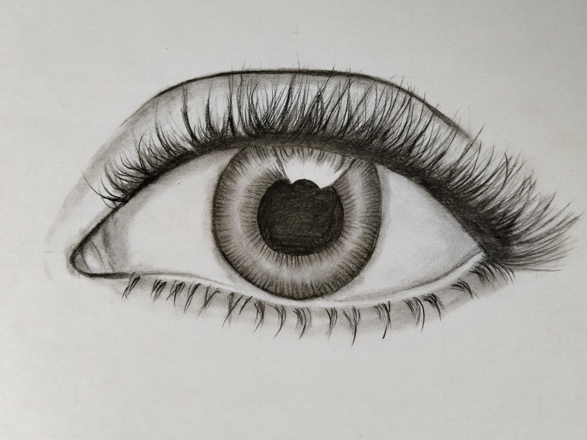

<html lang="en">
<head>
    <meta charset="UTF-8">
    <meta name="viewport" content="width=device-width, initial-scale=1.0">
    
    <link href="https://fonts.googleapis.com/css2?family=Poppins:wght@400;600;700;800&display=swap" rel="stylesheet">
    <link rel="stylesheet" href="https://cdnjs.cloudflare.com/ajax/libs/font-awesome/6.4.0/css/all.min.css">

    
</head>
<body>

    <!-- Ambient Glowing Background -->
    

        

        

    

    <!-- Header Section -->
    <header>
        

            
            <h1>Devartsx</h1>
        

        <nav>
            <a href="#hero">Home</a>
            <a href="#portfolio">Portfolio</a>
            <a href="#pricing">Pricing</a>
            <a href="#order">Order Sketch</a>
        </nav>
    </header>

    <!-- Hero Section -->
    <section class="hero" id="hero">
        <h2>Handmade Realistic Sketches</h2>
        
Get custom graphite & charcoal portraits created with high precision. Perfect gift for your loved ones.

        <a href="#order" class="btn"><i class="fa-solid fa-paintbrush"></i> Order Your Sketch</a>
    </section>

    <!-- Portfolio Grid -->
    <h2 class="section-title" id="portfolio">My Portfolio</h2>
    

        

            
        

        

            
        

        

            
        

        

            
        

    

    <!-- Pricing Section -->
    <h2 class="section-title" id="pricing">Sketch Pricing</h2>
    

        

            <h3>A4 Size Sketch</h3>
            
₹599

            
Perfect choice for single face portraits & closeups with graphite shading.

            <a href="#order" class="btn">Book A4 Size</a>
        

        

            <h3>A3 Size Sketch</h3>
            
₹999

            
Best for detailed couple portraits, religious art & deep charcoal work.

            <a href="#order" class="btn">Book A3 Size</a>
        

    

    <!-- Order Form Box Section -->
    <section class="order-section" id="order">
        

            <h3>Order Your Sketch</h3>
            <form onsubmit="sendToWhatsApp(event)">
                

                    <label for="name">Your Name</label>
                    <input type="text" id="name" required placeholder="Enter your full name">
                

                

                    <label for="phone">WhatsApp Phone Number</label>
                    <input type="tel" id="phone" required placeholder="Enter mobile number">
                

                

                    <label for="size">Select Artwork Size</label>
                    <select id="size" required>
                        <option value="A4 Size Sketch (₹599)">A4 Size Sketch - ₹599</option>
                        <option value="A3 Size Sketch (₹999)">A3 Size Sketch - ₹999</option>
                    </select>
                

                

                    <label for="notes">Special Instructions</label>
                    <textarea id="notes" rows="4" placeholder="Any specific requirements..."></textarea>
                

                <button type="submit" class="btn"><i class="fa-brands fa-whatsapp" style="font-size:1.3rem;"></i> Order via WhatsApp</button>
            </form>
        

    </section>

    <!-- Footer -->
    <footer>
        <h3>Devartsx </h3>
        
&copy; 2026 Devartsx. All Rights Reserved.

    </footer>

    <!-- WhatsApp Integration Script -->
    
</body>
</html>
